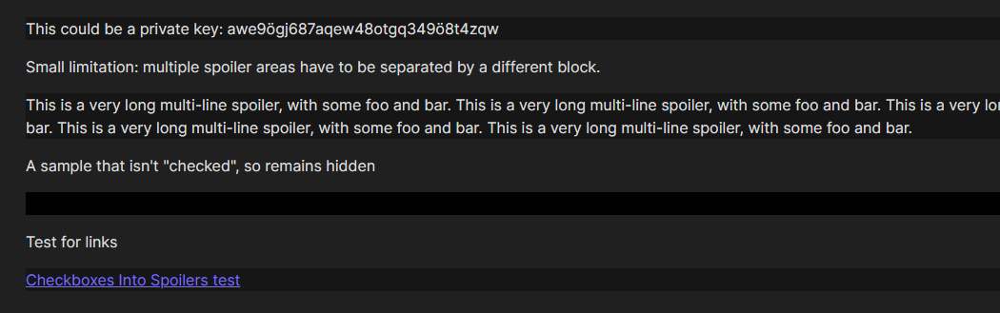
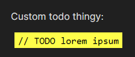
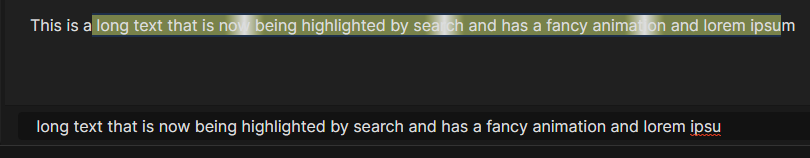
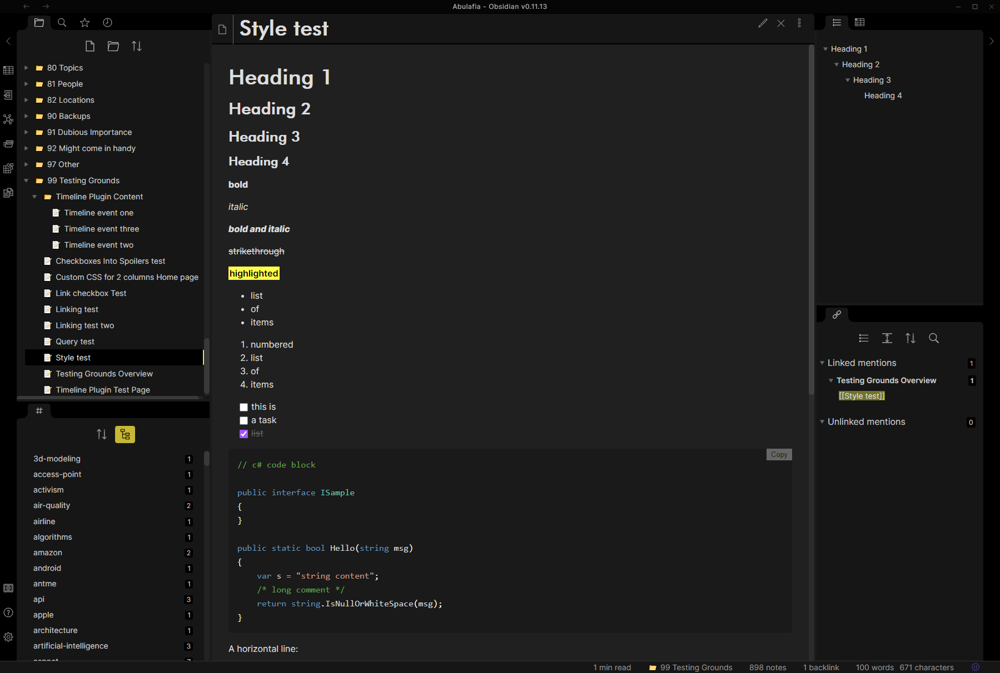

# obsidian-toolkit
Plugins, templates, css snippets and more for obsidian.md

## CSS Snippets

### Reusable snippets

#### `checkboxes-into-spoilers.css`

Add `snippets/checkboxes-into-spoilers.css` to your `<vault folder>/.obsidian/snippets/` folder.

Adding `cssclass: checkboxes-into-spoilers` into your yaml frontmatter changes the preview mode markdown checkboxes in that note into spoiler tags a'la Discord's `||spoiler||`. Spoilers have to be separated by a different block inbetween. See screenshot below.

#### `language-todo.css`

Changes code blocks with the language `todo` into bright yellow todo blocks that match my personal settings for them in ReSharper. See screenshot below.

#### `animated-search-highlight.css`

Changes search result highlight backgrounds into an animated one, a'la iOS's slide to unlock effect (except on the background and not on the text). See screenshot below.

### UI / Content theming

The following CSS snippets are intended to modify the basic obsidian theme. See screenshot below.

#### `ui-custom.css`

Modifies the Obsidian UI in the following ways:

- makes the UI fonts lighter, increasing readability and contrast
- adds yellow-ish accents instead of the blue ones
- shortens the flashing animation
- changes the note header to match an H1 block
- changes the note tree header
- adds icons to the tree (with an extra sample on how to add custom icons for custom paths)

#### `fonts.css`

Modifies the Obsidian markdown preview in the following ways:

- changes the headers to Futura BT Medium (assuming it's available on your PC)
- increases header sizes across the board
- changes code block highlighting to match the Visual Studio default dark theme
- changes the inline code blocks to a light blue color
- changes the highlights to a bright black-on-yellow style
